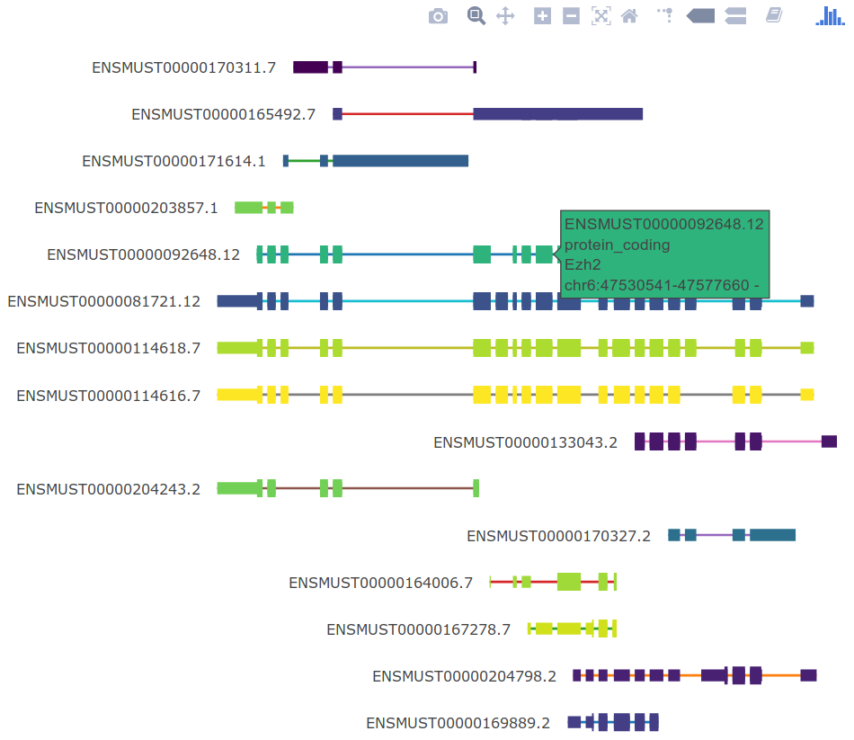

# plPlotTranscripts

Dynamic plots of transcripts structure using plotly


*(static screenshot)*

`plPlotTranscripts` displays transcripts intron-exon structures and allows to map colors, hover text and annotations to transcripts and/or exons.

**For usage instructions and examples, <a href="plPlotTranscripts.html" download>download and open the vignette here</a>, or see `vignette("plPlotTranscripts")`.**

<br/><br/>

### Required R packages

* GenomicRanges
* plotly
* seriation
* viridis (optional; for color mapping)
* rtracklayer (optional; for importing `gff` files to GRanges)

### Installation

```{r}
library(devtools)
install_github("plger/plPlotTranscripts", build_vignettes=T)
```

If you get an error during the building of the vignettes, you probably need to install phantomjs first through `webshot::install_phantomjs()` (alternatively, set `build_vignettes=F`).

